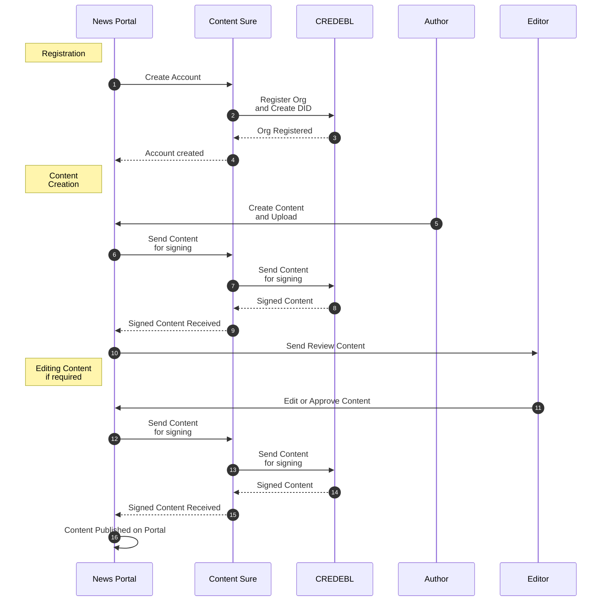

# Content Sure

```mermaid
sequenceDiagram
autonumber
participant News Portal
participant Content Sure
participant CREDEBL
participant Author
participant Editor

    Note left of News Portal: Registration
    News Portal->>Content Sure: Create Account
    Content Sure->>CREDEBL: Register Org <br>and Create DID
    CREDEBL-->>Content Sure: Org Registered
    Content Sure-->>News Portal: Account created

    Note left of News Portal: Content <br> Creation
    Author->>News Portal: Create Content <br>and Upload
    News Portal->>Content Sure: Send Content <br> for signing
    Content Sure->>CREDEBL: Send Content <br> for signing
    CREDEBL-->>Content Sure: Signed Content
    Content Sure-->>News Portal: Signed Content Received
    News Portal->>Editor: Send Review Content

    Note left of News Portal: Editing Content <br>if required
    Editor->>News Portal: Edit or Approve Content
    News Portal->>Content Sure: Send Content <br> for signing
    Content Sure->>CREDEBL: Send Content <br> for signing
    CREDEBL-->>Content Sure: Signed Content
    Content Sure-->>News Portal: Signed Content Received
    News Portal->>News Portal: Content Published on Portal

```
